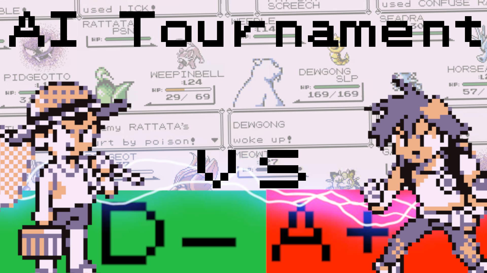

# Pokémon Red Elo World

Confused? You should probably watch the [accompanying video](https://www.youtube.com/watch?v=8yUPhRJtNJM) first. 

Or the [follow-up](https://www.youtube.com/watch?v=247qD1qulSQ).

If you just wanna watch battles, you probably want the [tutorial](tutorial.md).

## About this repo

This repo contains most of the code and data I used to run and analyze the tournament. It's very disorganized, but it should be relatively easy to get up and running (if not understand). This readme is far from a thorough explanation, though, so expect to need to do some fiddling. 

### Playing with the data

If you don't want to run a tournament yourself but instead just play with the data, [omega.pickle](omega.pickle) contains pretty much everything you'll need. In [common_methods.py](common_methods.py) you'll find a `load_pickle` method that will load the data (of course, you should generally be cautious of unpickling arbitrary data--it's as unsafe as running a binary. But you can trust me 🙂). The types are in [common_types.py](common_types.py). It probably requires Python 3.8 or newer. 

[elo_calculator.py](elo_calculator.py) is a hodge-podge of data analysis things I wrote while making the video. You probably won't want to try running this yourself, but you may want to use it as reference for playing with the data. If you don't want to use Python, it should be easy enough to make JSONs out of the data, but be wary of the circular references. You might want to replace the battle objects in the trainer class with references, and likewise for the trainer objects in the battle class. Battles have a unique `original_path` while trainers have a unique `class_id` and `instance_id` combination, so you may want to use these as keys. 

There are also a bunch of other files compiling data tangentially related to the tournament, including [trainers.json](trainers.json), [charmap.json](charmap.json), [items.json](items.json), [moves.json](moves.json), [pokemon_names.json](pokemon_names.json), and [trainers_by_order.txt](trainers_by_order.txt). It should be easy enough to figure out what these are about. 

### Running the tournament 

Running a tournament yourself should be easy, too, but expect some hurdles. Aside from what's in this repo, you'll need: 

* a copy of BGB (I used version 1.5.8)
* Pokemon Red (UE) [S][!].gb `md5: 3d45c1ee9abd5738df46d2bdda8b57dc` (this is the same rom produced by the [disassembly proejct](https://github.com/pret/pokered))
* Python 3.8 or newer

If you want video output, you'll also need: 

* ffmpeg
* [the CamStudio lossless codec](https://www.free-codecs.com/download/camstudio_lossless_codec.htm)

[battle_x_as_y.py](battle_x_as_y.py) is the main file that runs battles. You'll probably want to update `WORKING_DIR_BASE`, `OUTPUT_BASE`, and `BGB_PATH`. If you run this file, it should prompt you for a HashID, as described in the [tutorial](tutorial.md). 

I'll probably make a more detailed explanation for this code when I inevitably make a "Code Review" video. Stay tuned for that if you want more help, but in the meantime feel free to poke around the code. 

