Note: you'll need the "Pokemon GB" font for these to not look terrible.

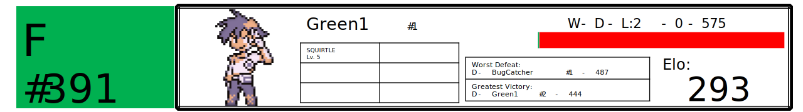
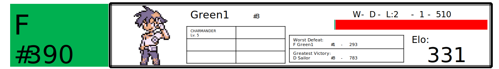
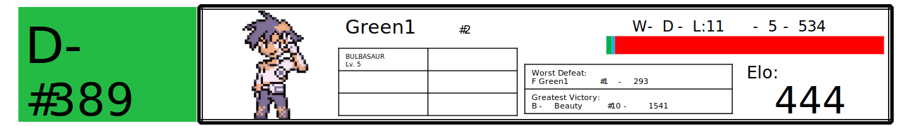

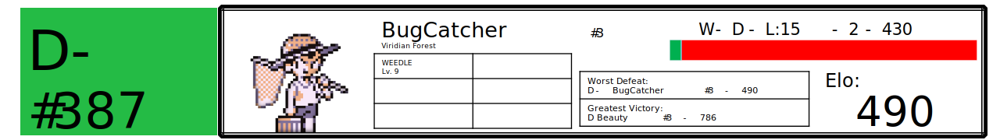

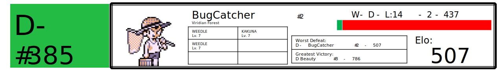
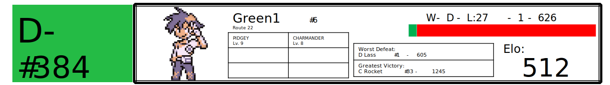
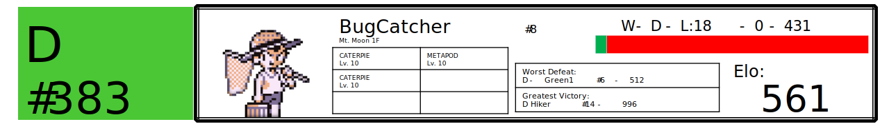

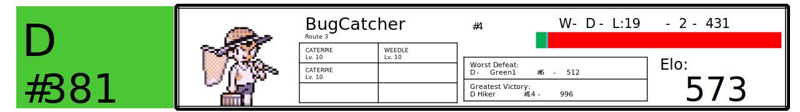
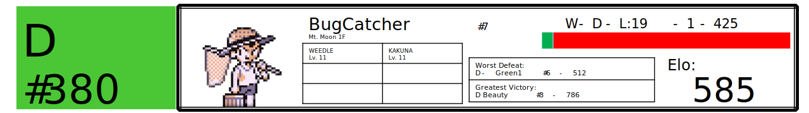

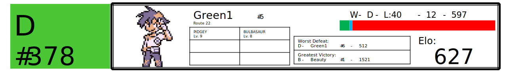
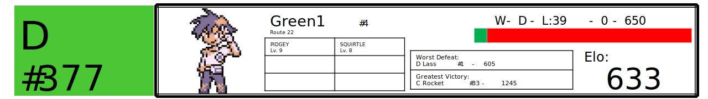

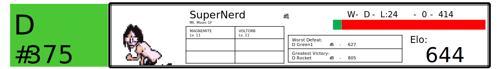
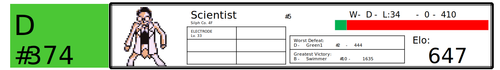
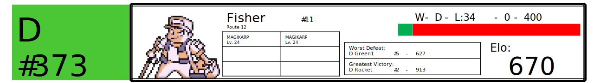
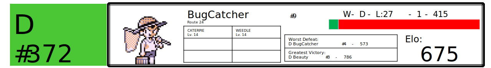
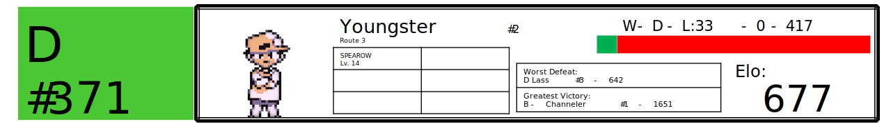
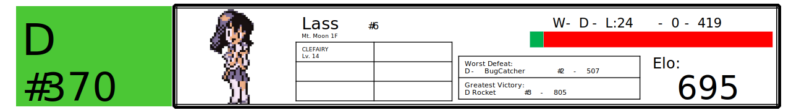

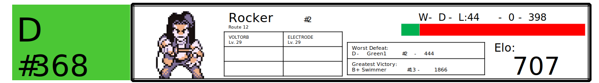
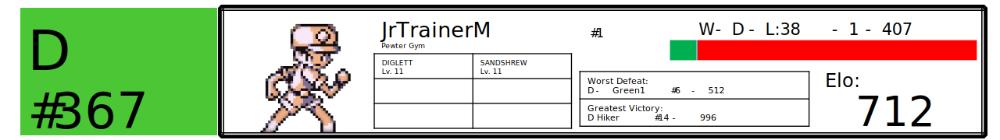
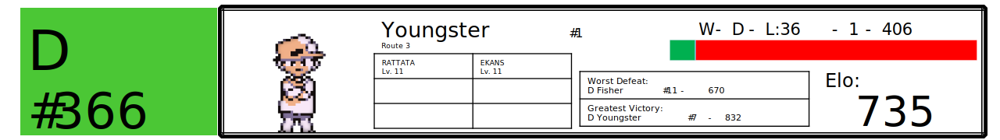
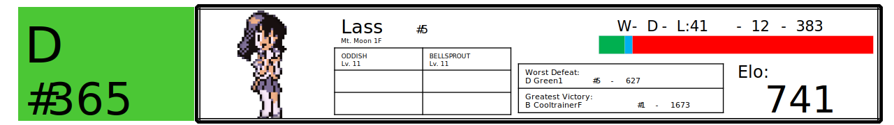
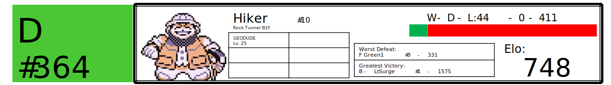
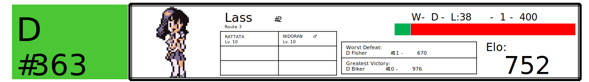
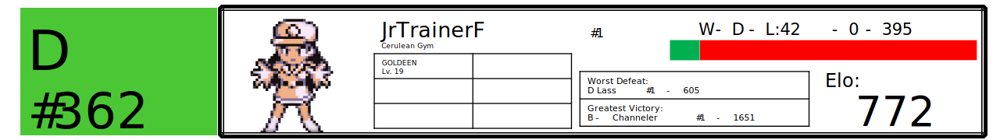
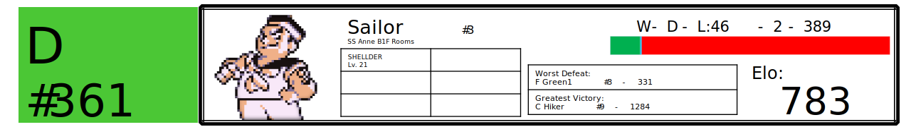
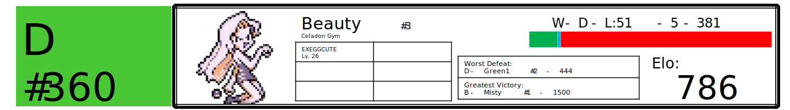
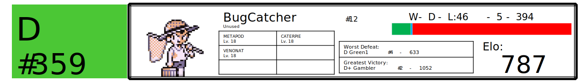
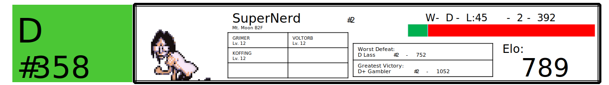
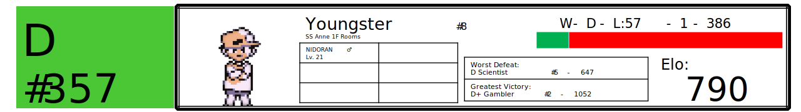
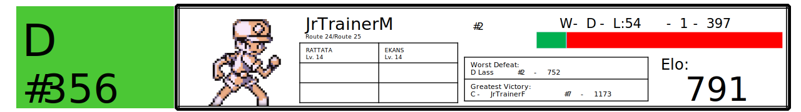
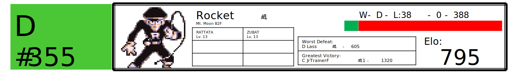
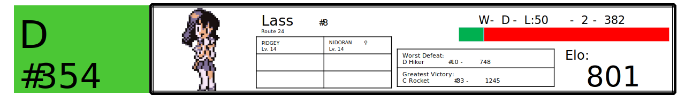
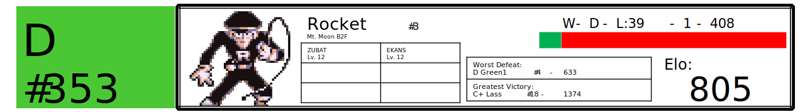
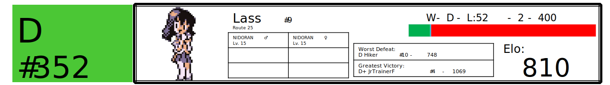
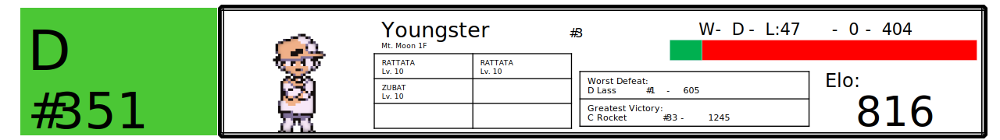
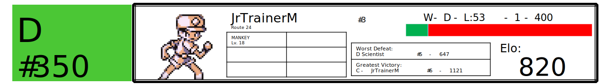
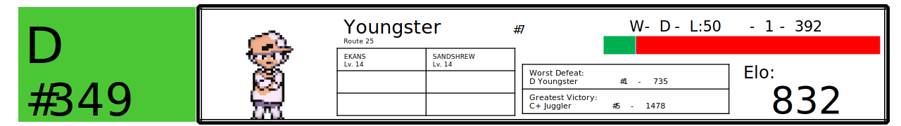
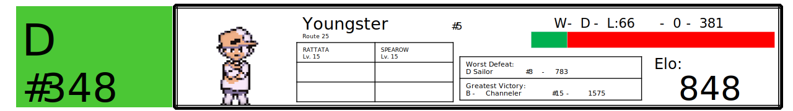

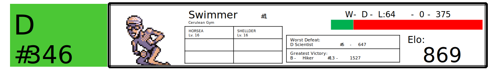
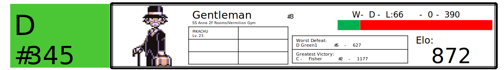
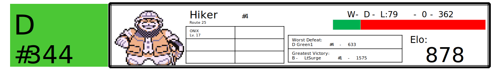

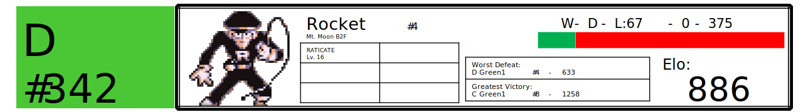
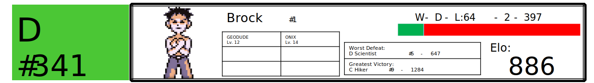
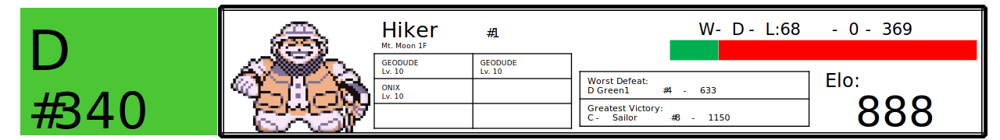
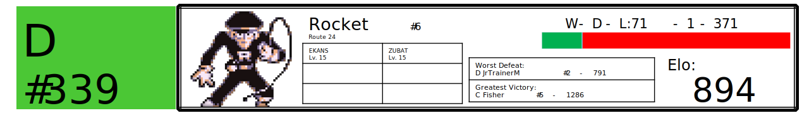
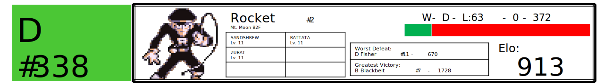
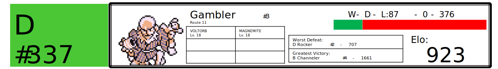

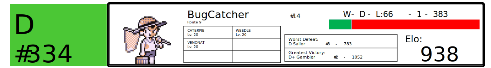
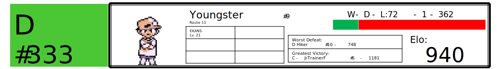
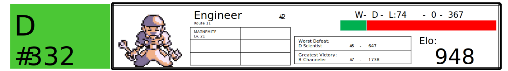


